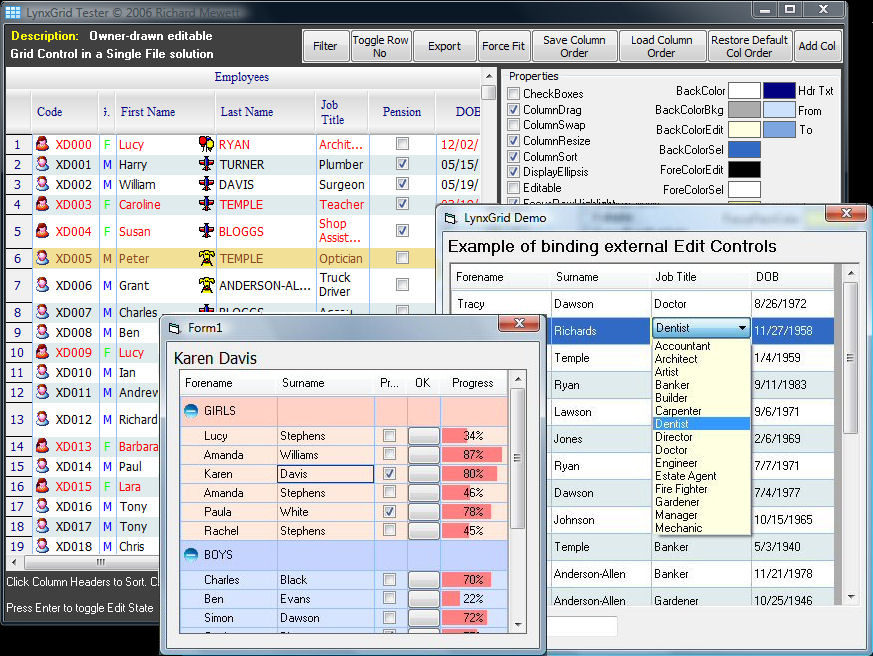



## LynxGrid 2\.17\.3 \(A professional grid in a single CTL\)

### Description

No voting please. The original author (Richard Mewett) has abandoned this Grid and is now using another; but this grid is too good to let die. This is a Major update (the number of changes made in this version are significant), so please read the HistoryLog before using. The HistoryLog also contains a list of all public subs, functions, and properties.

Notes: Not all properties are illustrated in the demo.

Oblivious omissions: Cell merging (got to complicated); Datacontrol support (which you should avoid anyway).

----

(Update: Added RowUnselect)
 
### More Info
 

             |
---                |---
**Submitted On**   |2007-05-10 06:40:02
**By**             |[Morgan Haueisen](https://github.com/Planet-Source-Code/PSCIndex/blob/master/ByAuthor/morgan-haueisen.md)
**Level**          |Advanced
**User Rating**    |5.0 (250 globes from 50 users)
**Compatibility**  |VB 6\.0
**Category**       |[Custom Controls/ Forms/  Menus](https://github.com/Planet-Source-Code/PSCIndex/blob/master/ByCategory/custom-controls-forms-menus__1-4.md)
**World**          |[Visual Basic](https://github.com/Planet-Source-Code/PSCIndex/blob/master/ByWorld/visual-basic.md)
**Archive File**   |[LynxGrid\_22207947122011\.zip](https://github.com/Planet-Source-Code/morgan-haueisen-lynxgrid-2-17-3-a-professional-grid-in-a-single-ctl__1-70425/archive/master.zip)

